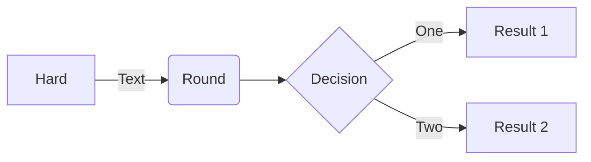

This plug adds basic [Mermaid](https://mermaid.js.org/) support to Silver Bullet.

For example:



**Note:** The Mermaid library itself is not bundled with this plug, it pulls the JavaScript from the JSDelivr CDN. This means _this plug will not work without an Internet connection_. The reason for this is primarily plug size (bundling the library would amount to 1.1MB). This way Mermaid is only loaded on pages with actual Mermaid diagrams rather than on every SB load.

## Configuration 
You can use the `mermaid` config to tweak a few things:

    ```space-lua
    config.set("mermaid", {
      version = "11.15.0",
      integrity = "new integrity hash",
      -- or disable integrity checking
      integrity_disabled = true,
      -- optional: pass Mermaid initialize options
      initialize = {
        securityLevel = "loose",
      },
      -- optional: center rendered diagrams in the widget
      center = true,
      -- optional: configure Mermaid themes
      theme = "default",
      look = "classic",
      fill_background = false,
      custom_themes = {},
      -- optional: register icon packs 
      icon_packs = {
        {
          name = "logos",
          url = "https://unpkg.com/@iconify-json/logos@1/icons.json",
        },
      },
    })
    ```

### Theming

The plug supports Mermaid's built-in themes (`default`, `base`, `dark`,
`forest`, `neutral`, and `null`) and named custom themes defined under
`custom_themes`. A custom theme uses `based_on` for the Mermaid base theme and
passes the remaining fields as Mermaid theme variables.

Per-diagram frontmatter can override `theme` and `fillBackground` inside
Mermaid's `config` section.
